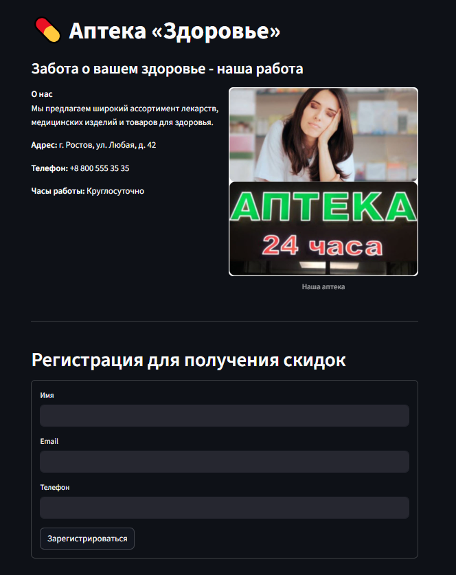

# Сайт-визитка с формой регистрации для аптеки

[](https://t.me/TeaTechnology)
[](https://github.com/MichiTheCat-RedStar)
[](https://michi-the-cat.itch.io)

**Одностраничный сайт-визитка для аптеки, включающий форму регистрации пользователей.  
Разработан в рамках курсового проекта.**

## Технологии

- Python 3.x (Язык Программирования)
- streamlit (Фреймворк)
- JSON (Для сохранения данных)

## Функциональность

- Краткая информация об аптеке (визитка)
- Форма регистрации (имя, email, телефон)
- Сохранение данных в базу (локальную, на JSON - в качестве примера всё в одном репозитории)
- Простой и адаптивный дизайн (в рамках моих возможностей и модуля streamlit)

## Установка и запуск

1. Клонируйте репозиторий:
   ```bash
   git clone https://github.com/MichiTheCat-RedStar/Course-Project.git
   ```
2. Убедитесь, что у вас установлена актуальная версия [Python](https://www.python.org/) (или больше 3.8 для простой установки)
3. Запустите для автоматической установки: [`requirements.bat`](./requirements.bat) на Windows или вставьте [`requirements.txt`](./requirements.txt) в pip для скачивания недостающих библиотек
4. Запустите [`start.bat`](./start.bat) на Windows, как приложение [`start.sh`](./start.sh) на Linux или `streamlit run app.py` в репозитори через терминал, ну либо `streamlit run путь/до/app.py`
5. Так же иногда streamlit предлагает указать почту для рекламы (обычно при первом запуске), можно просто пропустить, нажав Enter

---

### Условности

- Так как это макет сайта от человека без опыта в HTML и тем более знания CSS и JavaScript - сайт выполнен с уклоном в python и библиотеки для него
- Так как это _макет_ сайта, то безопасность данных здесь не реализована, все данные хранятся в том же репозитории, что и клиентская часть, ведь она и является серверной, а данные не хэшируются

---

### Инструменты разработки:

#### Раньше:

- ОС: Windows 10
- ЯП: Python 3.14
- IDE: Visual Studio Code
- Форматирование Markdown: Visual Studio Code

#### Сейчас:

- ОС: Xubuntu (Linux)
- ЯП: Python 3.9
- IDE Geany
- Форматирование Markdown: Ghostwriter

---

### Пример сайта:



_~~Обидно, что я не использую нейросети для создания курсовой работы, ведь действительно имею навыки программирования, помимо меня такими навыками обладают ещё человека три максимум, остальные же используют нейросети, даже не понимаю как форматированить HTML и что для этого не нужно IDE... Хотя они даже не знают что такое IDE, меня убивает эта система обучения... Искал гиков, а нашёл боль от одиночества из-за навыков...~~_